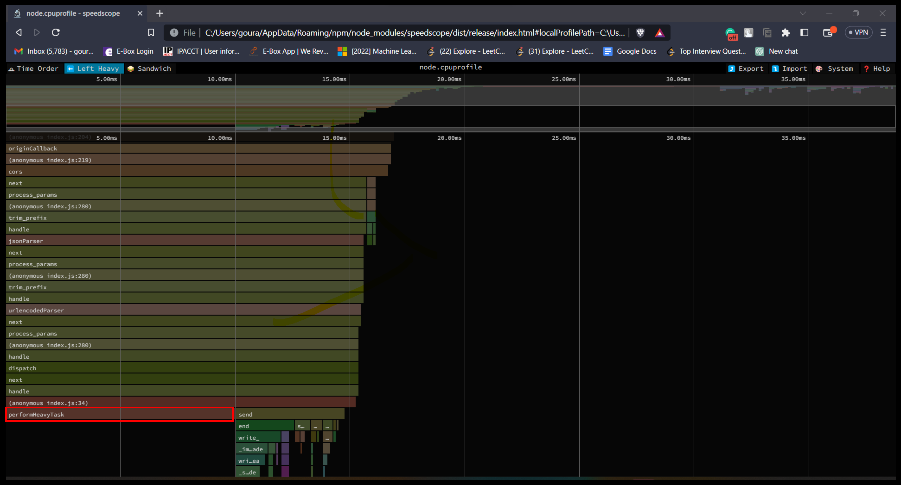
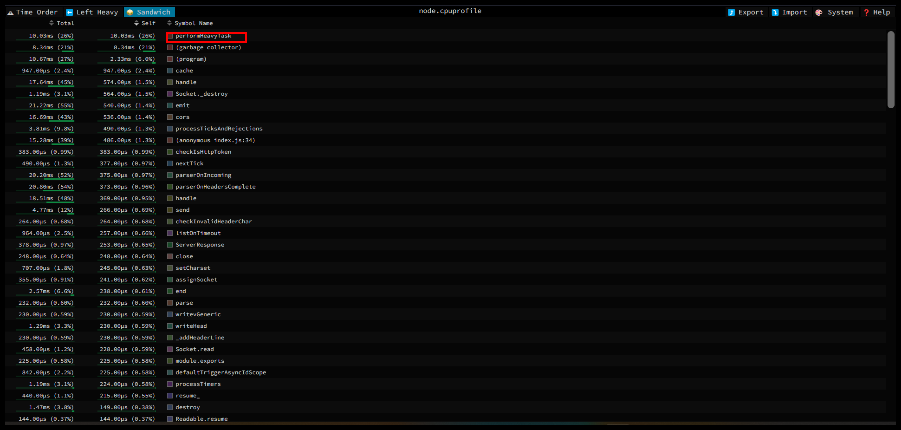

# mem-flamegraph
[](https://www.npmjs.com/package/mem-flamegraph)
[](https://github.com/Gourav2000/mem-flamegraph/blob/master/LICENSE)

## Description

A package that can be used to generate flamegraphs for cpu utilizations of each function on your node app.
## Installation

To install the package globally, run the following command:

```bash
npm install -g mem-flamegraph
```

## Dependencies

You need to install [speedscope](https://www.npmjs.com/package/speedscope) globally as it uses speedscope to generate the flamegraph. 

```bash
npm install -g speedscope
```

## Usage

Use mem-flamegraph to run a script and Immediately open the flamegraph in the browser::

```bash
mem-flamegraph app.js
```

It will create a node.cpuprofile in the root of your node app and generate a flamegraph html.


## Example

Let's create a node express app index.js to and generate flamegraphs according to the functions used and their cpu usage.

File: `index.js`

```javascript
const express = require('express');
const cors = require('cors');
const bodyParser = require('body-parser');
const app = express();
const port = 4000;
const fg= require("cpuprofile-to-flamegraph");
const fs= require('fs')

app.use(cors());
app.use(bodyParser.json());
app.use(bodyParser.urlencoded({
  extended: true
}));

const performHeavyTask = () => {
  var heavyTaskCount = 1;
  for (var x = 0; x < 1000000; ++x) {
    heavyTaskCount += Math.sqrt(heavyTaskCount * 3)
  }
  return heavyTaskCount;
}

app.get('/heavy', (req, res) => {
  const heavyTaskCount = performHeavyTask();

  res.send(JSON.stringify({ status: "ok", heavyTaskCount }));
});

app.listen(port, () => {
})
console.log(`Example app listening on port ${port}`)
```
Here notice the perform heavy task, You can see that it is not optimized will take up huge cpu load on exceution when the /heavy endpoint is hit.

Assuming you have mem-flamegraph and speescope installed in your system. Execute the below command to create a flamegraph for your node app.
```bash
mem-flamegraph index.js
```
A node.cpuprofile will be created in your root directory, and flamegraph will open up on your default browser like below.


Notice that perform heavy task tais marked red and takes up most cpu usage and thus needs to be optimized.



In sandwich mode you can see all the fubction sorted by their cpu usage.

## License
This project is licensed under the [MIT License](LICENSE).
